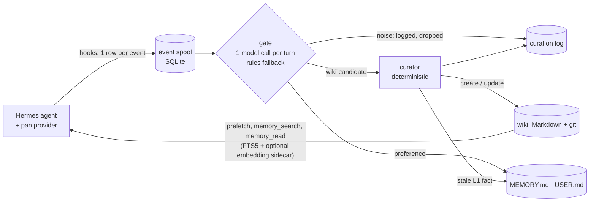

# pan-agent: auditable long-term memory for Hermes Agent

pan-agent (PAN, Persistent Agent Nexus) gives [Hermes Agent](https://github.com/NousResearch/hermes-agent)
a persistent, auditable long-term memory. It is a drop-in memory-provider plugin
(`memory.provider: pan`) and needs no changes to Hermes code. After each turn, a background daemon
decides what is worth keeping. It writes the result to a Markdown wiki under git, and each fact
records where it came from. The agent reads the wiki back through a per-turn recall block and two
tools. The prompt prefix stays append-only, so prompt caching stays intact. PAN runs with local
models (any OpenAI-compatible endpoint). Without a model, it uses a rules-only gate.

What it does differently: facts the user mentions in passing get saved without anyone asking the agent
to, and when a value changes later, the stale value is replaced rather than left next to the new one.
On a LongMemEval-derived held-out test set, Hermes + PAN answered 76.0 % of English and 76.7 % of
German / mixed questions across sessions, against 38.0 % and 40.0 % for stock Hermes on the same
local model (the author's own measurements; details and caveats under [Evidence](#evidence)).

## Quickstart

Install PAN into the venv Hermes runs from, then configure a profile. Use a scratch profile first.

```bash
PY=<hermes-venv>/bin/python        # e.g. the venv behind `readlink -f "$(command -v hermes)"`
uv pip install --python "$PY" "git+https://github.com/FRST-FRYTL/pan-agent@pan-v0.1.0a1"
export PATH="$(dirname "$PY"):$PATH"

export HERMES_HOME=$(mktemp -d)    # a scratch profile; ~/.hermes once you trust it
pan setup --dry-run                # shows the four Hermes settings it will change
pan setup                          # backs them up, sets memory.provider: pan, creates $HERMES_HOME/pan/
"$EDITOR" "$HERMES_HOME/pan/config.yaml"   # models.gate: your endpoint and model id (see below)
pan doctor                         # can this endpoint serve Hermes and PAN's gate?
pan memoryd run                    # the curator, in the foreground
```

Then use `hermes` as usual. After a turn, `pan memory inspect` shows what was captured and decided,
and `pan wiki search <query>` shows what was kept. A scripted two-session version of this is in
[docs/demo/](docs/demo/README.md).

## Evidence

These are the author's own measurements, made with a private harness (not yet public). The harness
runs multi-session conversations through real Hermes: stock Hermes against Hermes + PAN, on the same
model, **Qwen3.8-27B (NVFP4) on vLLM 0.30.1rc1 + PR #50021 on one NVIDIA DGX Spark**. A blinded
Claude judge scores the answers. The held-out test sets were never tuned on and were run once,
after the September 2026 improvement round. The tested PAN used hybrid retrieval with the
`pan-embedd` sidecar, which this release does not package (see [Known limitations](#known-limitations)).
The numbers hold only for this stack and are not comparable to published leaderboards.

| Measurement (judge-only pass rate, 95 % CI) | Stock Hermes | Hermes + PAN before the round | **Hermes + PAN 0.1.0a1** |
|---|---|---|---|
| LongMemEval-derived held-out test, English, 150 questions × 2 | 38.0 % [33, 44] | 69.7 % [64, 75] | **76.0 %** [71, 80] |
| LongMemEval-derived held-out test, German / mixed, 30 questions × 2 | 40.0 % [29, 53] | 68.3 % [56, 79] | **76.7 %** [65, 86] |
| ConvoMem-derived held-out test, 100 questions × 2 | 39.0 % [33, 46] | 72.5 % [66, 78] | **78.5 %** [72, 84] |
| Internal validation set, 48 scenarios × 5 (used to accept changes) | 55.4 % [49, 61] | 87.7 % [83, 91] | **93.1 %** [89, 96] |

- **The round's gain on English is +6.3 pp** over the version before it (paired, 95 % CI
  [+0.4, +12.3], p = 0.037). On the 30 German / mixed questions it is +8.3 pp, not significant.
- **Agent tasks:** on par with stock Hermes on 13 ordinary agent tasks from ported upstream Hermes
  evals (97.7 % vs 96.7 %, measured before the round; every round change kept accuracy in paired
  checks), at a paired median of about 1.1× stock's tokens per task (mean up to 1.4×, from a few long
  tool loops stock Hermes shows too). For the final version this ratio is inferred from paired runs
  against its predecessors, not measured against stock directly.

The method, all numbers, the per-task gains and the caveats: [docs/evaluation.md](docs/evaluation.md).

## How it works



- **Capture** runs inside Hermes. The provider and its hooks append events to a SQLite spool.
  They never block or raise into the agent loop.
- **Curation** runs in a separate daemon, `pan-memoryd`. For each finished turn, a gate decides
  what to keep and a deterministic curator updates the wiki and Hermes' own `MEMORY.md` /
  `USER.md`. It writes those files through Hermes' memory store.
- **Recall** is a `<memory-context>` block in the current user message, plus the tools
  `memory_search` and `memory_read`. Retrieval is hybrid: FTS5 plus embeddings and a reranker from
  the optional `pan-embedd` sidecar, or FTS5 alone without it. The system prompt block is static for
  the session.

Details, including the Hermes interfaces PAN relies on: [docs/architecture.md](docs/architecture.md).

## Requirements

- **Hermes Agent at the tested version.** 0.1.0a1 is tested with Hermes **0.21.4**, upstream
  commit `54c55307e3285a02f21185c1fd5b1f694489af80` (file `HERMES_BASE`).
  - Other Hermes versions may work, but they are untested. PAN logs a warning at startup, and
    `pan setup` refuses them unless you pass `--force`.
  - Each PAN release moves the tested version forward.
- Linux or macOS, Python 3.11–3.13 (Hermes' own venv), `git`, and `uv` (recommended).
- **A model.** Any OpenAI-compatible endpoint works: vLLM, Ollama, LM Studio, or a hosted
  provider. Minimum capabilities:
  - **tool calling**, for the agent (Hermes);
  - **`response_format: json_schema`**, for PAN's memory gate. `json_object` also works; set
    `models.gate.structured: json_object`.
  - Check an endpoint with `pan doctor` (see below).
  - **Without a suitable endpoint, PAN runs a rules-only gate** (`classifier: {kind: rules}`). It
    makes no model calls, but its quality is lower.
  - With a hosted endpoint, every conversation turn is sent to that provider.
- What PAN needs from a model, and the pitfalls of running Hermes against a local one:
  [docs/local-models.md](docs/local-models.md).
- **Optional: the `pan-embedd` retrieval sidecar** for hybrid retrieval (embeddings and reranking).
  It is not part of this release; without it PAN retrieves with FTS5 only. See
  [Known limitations](#known-limitations).

## Tested stack

The published results were measured with **Qwen3.8-27B-NVFP4 on vLLM 0.30.1rc1 + PR #50021 on a
single NVIDIA DGX Spark**, with MTP speculative decoding and prefix caching. The `pan-embedd` sidecar
ran on the same GPU with Qwen3-Embedding-0.6B and bge-reranker-v2-m3 (about 2.5 GB of GPU memory).

That server setup is its own project, the
[spark-vllm-agent-cookbook](https://github.com/FRST-FRYTL/spark-vllm-agent-cookbook) (tag `v0.1.0`, experimental). It pins the base image and
the vLLM patch, serves with the tested flags, and ships a standalone `verify.py` that runs the same
checks as `pan doctor`. That configuration passed a 24-hour soak under real benchmark load (no engine fault or restart). Any
other OpenAI-compatible model works with PAN, but the numbers here hold only for this stack.

## Install details

PAN installs **into the venv Hermes runs from**. It does not declare `hermes-agent` as a dependency,
so it never pulls in a second Hermes. Releases are published as git tags only (no PyPI).
`pan version` prints the PAN version, the tested Hermes version and the running one. The `pan`
executable lives next to Hermes' python; put that directory on `PATH` or call it by full path.

`pan setup` changes four Hermes settings through `hermes config set`, after a backup (details in
[docs/architecture.md](docs/architecture.md#how-pan-plugs-into-hermes)). One of them is
`memory.nudge_interval: 0`, which turns off Hermes' own background memory review, because PAN's
curator does that job. It is idempotent and never enables a service.

Point the gate at your endpoint in `$HERMES_HOME/pan/config.yaml`:

```yaml
models:
  gate:
    base_url: http://localhost:8000/v1   # your OpenAI-compatible endpoint
    model: primary                     # the default; set your model id (pan doctor lists the ids)
    api_key: EMPTY
# or, without a model:
# classifier: {kind: rules}
```

`pan doctor` reads `models.gate` from this config, or takes `--base-url … --model …`. It runs four
checks:
- whether the endpoint and model are reachable;
- a streamed tool-call probe;
- a repeated tool-call corruption check, which exercises a server's prefix cache;
- `json_schema` support.

Run the curator in the foreground (`pan memoryd run`) or once after a session
(`pan memoryd run --once`). `pan daemon install` writes a systemd user unit. It never enables the
unit; that is your call.

## Guided install

`skills/install-pan/SKILL.md` is an agent skill that walks through these steps, asks where a choice
is yours, and verifies the result with a test turn. Hermes and Claude Code can both use it. It
ships as a Claude Code plugin. The reference vLLM server has its own install skill in the
[cookbook](https://github.com/FRST-FRYTL/spark-vllm-agent-cookbook).

```text
/plugin marketplace add FRST-FRYTL/pan-agent
/plugin install pan@pan-agent
```

## Useful commands

| Command | What it does |
|---|---|
| `pan status` | spool, daemon, wiki and index state (including the vector index) for `$HERMES_HOME` |
| `pan doctor` | checks the model endpoint (reachability, tool calls, corruption, json_schema) |
| `pan wiki search <query>` / `pan wiki read <id>` | query the memory wiki |
| `pan memory inspect --session <id>` | captured events and the gate/curator decisions for them |
| `pan memory replay --out <dir>` | re-run curation on stored events in a scratch profile |
| `pan index rebuild` | rebuild the derived search index from the wiki (and re-embed it, when the sidecar is up) |

## Uninstall

If you installed the systemd unit, disable it and run `pan daemon uninstall` first.
`pan uninstall` restores the Hermes settings recorded by `pan setup`. After that, run
`uv pip uninstall --python "$PY" pan-agent`. Your memory data in `$HERMES_HOME/pan/` is left in
place.

## What PAN stores

Everything lives under `$HERMES_HOME/pan/` with your user's file permissions:
- `events.db` keeps the captured turns and tool-output excerpts **unredacted** for
  `daemon.event_retention_days` (default 30), so they can be re-curated.
- `dead/` keeps copies of events that failed processing.
- `curation-log.jsonl` records every decision, including the agent's own memory-tool writes as the
  agent wrote them.
- What PAN itself writes to the wiki and to `MEMORY.md` / `USER.md` passes a pattern-based secret
  filter (best-effort).

Treat the directory like your shell history.

## Known limitations

- **One tested Hermes version.** Hermes moves fast. A newer Hermes may work (`pan setup --force`),
  but that is untested until a PAN release says so. Besides the plugin interfaces, PAN relies on a
  few Hermes internals: its memory store, a read-only session database, the list of core tool names
  and the `HERMES_HOME` override. All of these live in one module (`src/pan/hermes/compat.py`), and
  contract tests guard them at the tested version. If an assumption breaks, the provider does not
  yet switch itself off.
- **Hybrid retrieval needs the `pan-embedd` sidecar, which is not packaged in this release** (it is on
  the [Roadmap](#roadmap)). The tested numbers used the sidecar.
  - Hybrid is the default (`retrieval.mode: hybrid`, sidecar at `retrieval.embed_url`, default
    `http://127.0.0.1:8091`). Without a reachable sidecar, **PAN falls back to FTS5-only retrieval**
    for prefetch, `memory_search` and the curator, and logs a warning. After a refused connection or
    three timeouts in a row, a circuit breaker skips the sidecar for 30 s. `retrieval.mode: fts`
    turns hybrid retrieval off.
  - The fallback is easy to miss: it shows only in the logs, and `pan doctor` does not check the
    sidecar yet. `pan status` shows whether a vector index exists.
  - FTS-only retrieval misses more paraphrases and cross-language questions (German question,
    English memory). The FTS-only configuration of this release was not benchmarked on its own.
  - PAN identifies the embedding model through the sidecar's `/health` response, so other embedding
    servers are untested.
- **Weak spots:** questions about something that was never said (PAN gives a concrete answer more
  often than stock Hermes), and aggregation across many sessions (about 66 %). What the assistant
  said it did without a tool output is kept, but only as an unverified `Assistant reported:` claim
  that never overrides observed facts.
- **Gate request shape:** the memory gate sends `chat_template_kwargs` (a vLLM/SGLang extension
  that switches thinking off). When an endpoint rejects it with HTTP 400/422, as some hosted APIs
  do, the gate retries once without it and keeps it off for the rest of the daemon's run
  (`models.gate.template_kwargs: auto`; `never` skips the field, `always` never drops it). Such an
  endpoint then decides with its own thinking default, which can be slower. Local vLLM/SGLang
  servers are unaffected.
- **Gate latency:** each turn costs one gate call in the background daemon, roughly 5–10 s under
  benchmark load on the reference stack. Memory from a turn is available only after the daemon has
  processed it.
- **Linux-first.** The systemd unit is Linux-only. macOS works with `pan memoryd run` but is less
  tested. Windows is untested.
- **Single user per profile.** No multi-user or shared-memory mode.
- **One systemd unit per user.** `pan daemon install` writes a single `pan-memoryd.service`, so a
  second profile overwrites the first. For several profiles, run `pan memoryd run` per profile.

## Status

Ongoing personal project, research preview (0.1.0a1).
- It is tested on the setup described under [Requirements](#requirements).
- Issues and pull requests are welcome and handled best-effort. There are no support guarantees.
- APIs, configuration keys, the wiki layout and the on-disk storage format may change without a
  migration path.

## Roadmap

From the open work, in no fixed order:
- package the `pan-embedd` retrieval sidecar (with notices for its models), and make a missing
  sidecar visible: a `pan doctor` check and a louder warning;
- retrieval at scale (vector scoring beyond a few thousand units) and better reranker calibration
  for German questions over English memory;
- `Assistant reported:` claims: expiry or confirmation by later observations, a check that the agent
  treats them as unverified, and documented precedence of reported, inferred and observed facts;
- superseding changed preferences in `USER.md`, which PAN currently keeps next to the new one;
- fewer invented answers to questions about things never said, and better multi-session aggregation;
- a long-horizon test (weeks of real use), and a public benchmark harness, so the comparison can be
  reproduced on other models.

## Docs

- [docs/architecture.md](docs/architecture.md): how PAN plugs into Hermes' harness.
- [docs/evaluation.md](docs/evaluation.md): how PAN is measured, the results, and how to read them.
- [docs/local-models.md](docs/local-models.md): field notes on running Hermes on a local vLLM model.
- [docs/decisions.md](docs/decisions.md): the design decisions (ADRs) that matter to users.
- [docs/development.md](docs/development.md): how the project is built.
- [docs/demo/](docs/demo/README.md): a scripted two-session demo with a recording.
- [spark-vllm-agent-cookbook](https://github.com/FRST-FRYTL/spark-vllm-agent-cookbook): the tested vLLM server setup (separate repo, experimental).
- [CONTRIBUTING.md](CONTRIBUTING.md), [SECURITY.md](SECURITY.md), [CHANGELOG.md](CHANGELOG.md).

Built and maintained by FRST-FRYTL. MIT licence ([LICENSE](LICENSE), [NOTICE](NOTICE)); an independent add-on, not affiliated with Nous Research.
