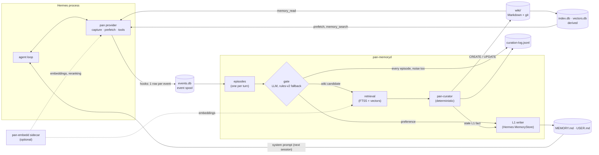

# Architecture

This page describes how pan-agent 0.1.0a1 plugs into the
[Hermes Agent](https://github.com/NousResearch/hermes-agent) harness: which interfaces it uses,
what it captures, how memory gets back into the prompt without breaking prompt caching, and what
happens when something fails. See also [decisions.md](decisions.md) and
[evaluation.md](evaluation.md).

## What Hermes has, and what PAN adds

Hermes keeps long-term memory in two small files. `MEMORY.md` holds agent notes and `USER.md` holds
the user profile, with default limits of 2,200 and 1,375 characters. A frozen snapshot of both goes
into the system prompt at session start. The files change when the agent calls its `memory` tool,
or when Hermes' background review adds entries every few turns. Past sessions can be searched with
`session_search`.

That design is simple and cache-friendly. It leaves four gaps:

- **Facts mentioned in passing are rarely saved.** Nobody asked the agent to save them.
- **Memory is opaque.** There is no record of why something was remembered or not, where a fact came
  from, or what it replaced.
- **Memory goes stale.** When a value changes later in a normal sentence, the old entry stays unless
  the agent replaces it.
- **More memory in the system prompt costs tokens on every turn.** Changing the prompt mid-session
  also breaks prompt caching.

PAN keeps Hermes' loop, tools, sessions and L1 files. It adds a Memory Plane: capture on every turn,
a background curator, a Markdown wiki under git with provenance, and recall on demand.

## How PAN plugs into Hermes

PAN is two processes that share files under `$HERMES_HOME/pan/`:

- **The `pan` memory provider** runs inside the Hermes process. It captures events and serves
  reads. It never blocks or raises into the agent loop.
- **`pan-memoryd`** is a separate daemon, one instance per `HERMES_HOME` (an exclusive `flock` on
  `pan/memoryd.lock`). It does all curation. Run it in the foreground (`pan memoryd run`) or as a
  systemd user unit (`pan daemon install` writes the unit; it never enables or starts it).

No Hermes file is modified. `pan setup` sets four Hermes keys through `hermes config set`:

| Key | Value | Why |
|---|---|---|
| `memory.provider` | `pan` | load PAN as the external memory provider |
| `memory.memory_enabled` | `true` | keep `MEMORY.md` in the prompt |
| `memory.user_profile_enabled` | `true` | keep `USER.md` in the prompt |
| `memory.nudge_interval` | `0` | turn off Hermes' background memory review, so PAN is the only automatic L1 writer |

It backs up the previous values first (`pan/setup-backup.json`); `pan uninstall` restores them.
Hermes runs its built-in memory plus at most one external provider, so PAN cannot be combined with
another external memory provider.

### Entry point

The package registers `pan = "pan.hermes"` in the `hermes_agent.memory_providers` entry-point group.
With `memory.provider: pan`, Hermes' loader calls `pan.hermes.register(ctx)`. It does two things:

1. `ctx.register_memory_provider(PanMemoryProvider())`, the provider;
2. `ctx.register_hook(...)` for six general plugin hooks. Hermes forwards these from a memory
   provider to its plugin manager. If hook registration fails, PAN logs a warning and keeps the
   provider; capture then falls back to the provider hooks alone.

### Provider lifecycle

`PanMemoryProvider` implements Hermes' `MemoryProvider` interface:

| Method | What PAN does |
|---|---|
| `is_available` | always true: local files only, no credentials or network |
| `initialize(session_id, hermes_home=…, agent_context=…, …)` | resolves `$HERMES_HOME/pan/`, loads the config, starts capture for the session, checks the Hermes version (a warning, never a failure), and opens a read-only reader on the index and wiki |
| `system_prompt_block` | static text, computed once per provider instance (see [Read path](#read-path)) |
| `get_tool_schemas` / `handle_tool_call` | `memory_search` and `memory_read` |
| `prefetch(query)` | recall for the upcoming turn; Hermes calls it at turn start |
| `sync_turn(user, assistant, messages=…)` | records the finished turn, with the recall text PAN injected, so the daemon does not mistake a restatement for new knowledge. Hermes calls it from its background worker after a completed turn and skips interrupted turns |
| `on_memory_write` | records the agent's own `memory` tool writes to `MEMORY.md` / `USER.md` |
| `on_pre_compress` | records a compaction marker; returns an empty string, so PAN adds nothing to the summary prompt |
| `on_delegation`, `on_session_switch`, `on_session_end` | delegation results, session id changes (reset, rewind), session end |
| `shutdown` | closes capture and the reader |

Capture is skipped for the `cron` and `flush` agent contexts (`capture.skip_agent_contexts`).
Every capture call is wrapped: an exception is logged at debug level and dropped.

### Hooks and what they capture

Each hook callback accepts `**kwargs`, never raises, and writes one spool row per event. Events
for sessions the provider never initialized are dropped, so contexts without capture produce
nothing.

| Hook | Captured as |
|---|---|
| provider `sync_turn` | the turn: user text, assistant text, the new tail of `messages`, and the recall text that `prefetch` returned for that turn |
| provider `on_memory_write` | an `l1_write` event: action, target, content |
| provider `on_pre_compress`, `on_delegation`, `on_session_switch`, `on_session_end` | compaction, delegation, session-switch and session-end events |
| plugin `post_tool_call` | a `tool_call` event: tool name, capped arguments, status, error, duration, and a head-and-tail excerpt of the result (8 KB by default, `capture.tool_result_excerpt_bytes`). Successful `write_file` and `patch` calls also add one `file_change` event per path |
| plugin `subagent_start` | the child's role and goal; the child session is bound to the parent, so its tool calls are captured too |
| plugin `subagent_stop` | the child's status, summary and tool-call history (at most 200 entries) |
| plugin `on_session_end` | a turn end. Hermes fires it at the end of every `run_conversation`, including interrupted turns |
| plugin `on_session_finalize` | a real session close, deduplicated with the provider's `on_session_end` |
| plugin `on_skill_lifecycle` | a skill event: action, skill name, use count |

The spool is `events.db` (SQLite, WAL mode). Tool results are excerpted, never stored in full.

## Read path

The agent gets memory in three ways. None of them changes the cached prompt prefix.

- **System prompt block.** Static text: a wiki exists, `memory_search` and `memory_read` are
  regular tools to call directly by name, PAN has no other tools, and the agent's own `memory` tool
  works as usual. It sets a few rules: check the user profile and open a listed page before saying
  there is no record; the newest statement wins (what the user says now beats memory, and a later
  wiki fact beats an older `MEMORY.md` / `USER.md` entry); apply remembered constraints to advice;
  use only values memory states, and keep status words as written ("proposed" is not "accepted").
  Under "Wiki pages:" it lists the wiki's pages from `index.md` (at most 800 characters); an empty
  wiki adds nothing. It is computed once and does not change during the session.
- **Prefetch.** Before each turn, Hermes calls `prefetch` with the user message. PAN runs the
  retrieval pipeline below and returns at most 4 pages: id, title, type and the best-matching
  current facts, within 1,500 characters by default (`retrieval.*` in the config). It prepends the
  active preferences from `USER.md` (at most 500 characters), ordered by relevance to the request,
  with near-duplicates and fragments left out, under a header that asks the agent to follow each one
  that bears on the request: the tested model followed them poorly when they were only in the system
  prompt.
  Hermes wraps the text in a `<memory-context>` fence with a note that it is recalled context,
  not new user input, and appends it to the **current user message**. Hermes also scrubs that
  fence from streamed output.
- **Tools.** `memory_search` (query, optional limit, default 5, at most 20) returns page ids,
  titles and the best-matching current facts. `memory_read` (page id or wiki path, optional section;
  output capped at 20,000 characters) returns the page's id, title, type, status, last update and its
  current facts. Superseded facts come last, under a heading that says they are no longer current
  but still true for that earlier time. Both read the index and the wiki directly. A tool error comes
  back as a JSON error, never as an exception. A contract test checks that the two names do not
  collide with Hermes' core tools and that Hermes' memory manager routes them to PAN.

### How recalled facts are presented

What the agent sees is a presentation of the stored page; the file itself keeps its full
provenance (`pan wiki read` shows it as stored).

- The stored `(stated YYYY-MM-DD)` stamp is shown as `(noted YYYY-MM-DD)`, the day the fact was
  recorded, so the agent does not take it for the date of the event.
- Session and event ids and provenance lines are left out. Recall snippets drop the evidence labels
  but keep the `Assistant reported:` prefix, and rank observed facts before inferred ones;
  `memory_read` drops only `(observed)` and keeps `(inferred)` and `Assistant reported:`.
- The meaning of a marker (`(noted …)`, `Assistant reported:`, `(inferred)`, superseded) is
  explained in one short note next to the recall block or tool result where it appears, not in the
  system prompt.
- Prefetch lines leave out the default page status "active".

### Hybrid retrieval

Prefetch, `memory_search` and the curator's page lookup use one retrieval pipeline
(`retrieval.mode`, default `hybrid`):

1. **FTS5** over the derived `index.db`, always available.
2. **Dense retrieval** over the derived `vectors.db`: each page is embedded as a card (title,
   subject, tags), one unit per current claim, and chunks of prose. The page score is its best
   unit; cosine similarity is mapped to [0, 1] so the FTS thresholds keep their meaning.
3. **Fusion:** weighted reciprocal-rank fusion (k = 60) of both lists into 20 candidates.
4. **Reranking** (prefetch and `memory_search` only): a cross-encoder scores the candidates within
   0.5 s (`rerank_timeout_s`); over budget, the fused order is used. A message with several
   questions or paragraphs is also scored per question and for each of its last two paragraphs, and a page keeps its
   best score, because a cross-encoder scores a chatty turn near 0 even for the right page.
5. **Prefetch gate:** a reranked page enters the recall block if its relevance is at least 0.002
   and at least 1 % of the best page's, or if its fused score before reranking is at least 0.4.
   Without reranking, the fused score must reach 0.2 (`prefetch_min_score`). Absolute paths in the
   message are shortened to their last component before the search, so a working-directory
   preamble does not lift every page.

The embeddings and the reranker come from **`pan-embedd`**, a small, stateless HTTP sidecar
(OpenAI-style `/v1/embeddings`, Cohere-style `/v1/rerank`, and a `/health` endpoint that names the
models). It is not part of this release. PAN talks to it with the standard library, at
`retrieval.embed_url` (default `http://127.0.0.1:8091`). The tested models are Qwen3-Embedding-0.6B
and bge-reranker-v2-m3.

**Without the sidecar, retrieval is FTS5 only,** as in earlier versions:
- the dense stage returns nothing when the sidecar is unreachable or serves a different model
  than the one `vectors.db` was built with; a failing reranker leaves the fused order;
- after a refused connection or three timeouts in a row, a circuit breaker skips the sidecar for
  30 s and logs a warning, so a missing sidecar does not cost a timeout on every turn;
- `pan-memoryd` logs once that `vectors.db` was not updated, and catches up at its next sync;
- `retrieval.mode: fts` (and `retrieval.curator_mode: fts`) switch the dense path off entirely.

`vectors.db` records the embedding model, revision and dimension. A reader whose sidecar serves
another model ignores the vectors until `pan index rebuild` re-embeds the wiki.

Reads do not need the daemon. If `pan-memoryd` is down, recall keeps working and only new
curation stops. Subagents get no PAN tools.

### Why the prompt prefix stays append-only

Prompt caching reuses the longest unchanged prefix of the request. Anything that rewrites earlier
bytes (the system prompt, an old message) invalidates the cache from that point on, for every
later turn of the session. PAN avoids that:

- the system prompt block is fixed for the session;
- per-turn recall goes into the newest user message, which is past the cached prefix. Later turns
  replay the same bytes for that message, so it becomes part of the prefix unchanged;
- L1 changes made by the daemon reach the system prompt only when Hermes rebuilds it: at the next
  session, or after compaction.

The ported upstream cache-prefix eval measured 100 % append-only prompt prefixes for both stock
Hermes and Hermes + PAN ([evaluation.md](evaluation.md#agent-tasks-and-cost)).

## Write path: the background daemon

### Why curation runs out of band

Deciding what to keep costs one model call per turn, roughly 5–10 s under benchmark load on the
reference stack. Applying it means page writes, validation, a git commit and a reindex. In the agent loop,
that would add latency to every turn and make the agent depend on the gate's endpoint. PAN uses
the agent's own model and endpoint for the gate, with no second model to host (ADR-008 in
[decisions.md](decisions.md)). The gate therefore competes with the agent for the same server,
and running it in the background keeps it off the agent's critical path. The cost is a delay: memory from a turn
exists only after the daemon has processed it.

The daemon polls the spool, every 2 s by default, and processes a batch:

```text
claim events → group into episodes → gate → retrieve → curate → apply → reindex (FTS5, vectors) → mark done
```



### Per episode

1. **Episodes.** Events are grouped into episodes: one agent turn with its tool calls. A turn that
   has not finished is released back to the spool. Idle groups close after 30 minutes
   (`daemon.episode_idle_minutes`). If Hermes' `state.db` holds the missing turn, for example after
   a crash, the daemon completes the episode from it, read-only.
2. **Gate.** Deterministic code runs first. It strips tool calls the model printed as text, redacts
   secrets in everything the model will see, and skips trivial episodes (empty, questions only,
   thanks only, with no tool call). Then one call to `models.gate` (JSON schema output,
   temperature 0, thinking off) gets the episode, the previous turn, the recalled text and an L1
   snapshot. It decides whether to record, the kind, the destination (none, `USER.md` or the
   wiki) and the claims. Each claim carries an evidence class: `user_stated`, `user_confirmed`,
   `tool_observed` or `assistant_inferred`. Deterministic post-checks always follow:
   - a claim must be grounded in its source text, values included; otherwise it is downgraded to
     inferred or dropped. A claim grounded in this turn's user text is relabelled `user_stated`;
   - inferred claims that echo recalled text, L1 or the user's words are dropped;
   - **assistant-reported claims:** an inferred claim that would be dropped is kept as
     `assistant_reported` when it is the assistant's own report of this turn: an action, a decision
     or a result, grounded in the assistant's text with every value. Offers, plans, advice, hedges
     and general knowledge are still dropped, and when a tool ran, its values must be in the tool
     output or the user's words. The class is set only by these checks, never by the model. The
     text is prefixed `Assistant reported:`, labelled `(reported)` and never reaches L1;
   - user facts are not dropped as third-party facts because of the gate's own "their" rewrite of
     the user's "my", and a hedge in another clause of the sentence no longer drops a claim;
   - a tool-observed claim with a date or clock time (a log line, a CSV row) is a past event and is
     kept long-term;
   - only the user's own words can become preferences;
   - the output is scanned for secrets again;
   - relative dates are resolved, and claims carry `(stated YYYY-MM-DD)`.
3. **Retrieval.** Wiki candidates look up related pages with FTS5 and, when the sidecar is up,
   dense vectors (fused, no reranking, with a stricter similarity calibration so that only close
   matches become updates). A page whose `subject` or title matches the candidate's subject is the
   update target first.
4. **Curation.** `deterministic-v1` decides per candidate, with no model call:
   - **IGNORE** when every claim is already on a retrieved page;
   - **UPDATE** a matching page by appending the claims under `## Updates`;
   - else **CREATE** a page from its type template.

   An observed claim that contradicts a bullet on the target page strikes that bullet through
   (`~~old~~`, with date and source). For gate candidates, a strike needs the gate's explicit
   `supersedes`, or a typed-value contradiction of the same attribute of the same subject. Claims
   about different occasions (other dates, another place) never supersede each other unless the gate
   says so. An inferred claim never overrides an observed one. A reported claim never strikes an
   observed or inferred bullet; a newer report replaces only an older report of the same attribute.
5. **Apply.** Pages are written and validated; a write that breaks validation is reverted. There is
   one git commit per batch, by author `pan-memoryd`, covering only the daemon's own paths. New
   pages are linked from `index.md` in the same commit, and the indexes are updated (`vectors.db`
   only when the sidecar is up). If the agent
   edited a wiki file itself, the edit is committed as-is with author `hermes-agent`.
6. **Log.** Every episode gets a record in `curation-log.jsonl`, noise included: the
   classification, the gate status and latency, and the curator decision.

`classifier.kind` selects the gate: `llm` (the default), `rules` (rules-v2 only, no model calls,
with the same secret filter), or `shadow` (runs the LLM gate next to the rules, which still decide).

### L1 through Hermes' own MemoryStore

PAN writes `MEMORY.md` and `USER.md` only through Hermes' `MemoryStore`. It uses the same file lock
and entry format as the agent's `memory` tool, so a running agent sees no external drift.

- **Add.** Preferences in the user's own words go to `USER.md`.
- **Dedupe.** An entry already stated in either file is not added again.
- **Reconcile.** When a newer observation contradicts a factual entry on the same subject (a
  different port, host, path or version), the entry is rewritten in its own phrasing, or
  replaced, through `MemoryStore.replace`. When the gate explicitly marks an old statement as
  replaced, an entry stating it is replaced even without a typed value. In a multi-sentence entry,
  only the sentence with the old statement is replaced. If the new fact is already another entry,
  the stale one is removed. This applies whether the agent or PAN wrote the entry. Reported claims
  are never used to reconcile L1.
- **Never touched:** preference entries, and entries written after the observation.
- **Full.** If the entry does not fit the character limit, nothing is written (`l1_full` in the
  log), and the fact goes to the wiki instead.
- **Agent writes.** A factual `MEMORY.md` entry the agent writes with its own tool is reconciled
  against the other L1 entries and passed to the curator as an inferred claim. When the wiki already
  has the fact, only the page's `sources` gain a link to it. An agent `replace` supersedes the old
  wiki bullet.

## The compat module and contract tests

Besides the plugin interfaces, PAN uses a few Hermes internals. All of them live in one module,
`src/pan/hermes/compat.py`; nothing else in PAN imports Hermes internals.

| Internal | Used for |
|---|---|
| `hermes_cli.__version__` | the version check against the tested Hermes |
| `toolsets._HERMES_CORE_TOOLS` | making sure PAN's tool names cannot collide with core tools |
| `tools.memory_tool` (`load_on_disk_store`, `ENTRY_DELIMITER`) | L1 writes through Hermes' `MemoryStore` |
| `hermes_constants.set_hermes_home_override` | pointing the daemon's L1 writes at the right profile |
| `hermes_state.SessionDB(read_only=True)` | completing crashed turns from `state.db` |

The contract tests in `tests/contract/` run against the real Hermes at the tested commit. They pin:

- entry-point discovery, and that `register` provides the provider and the hooks;
- every `MemoryProvider` method PAN implements, and that `sync_turn` receives `messages`;
- the six plugin hooks and the keyword arguments their call sites pass;
- tool routing through Hermes' memory manager, and no collision with core tools;
- L1 writes without drift, the character limits, and reconciliation;
- the read-only `state.db` schema and crash backfill;
- the `memory.*` config keys, and a `pan setup` / `pan uninstall` round trip.

An upstream change therefore shows up as a failing test, not as a runtime error in a user's agent.
The fix goes into `compat.py`; Hermes itself is never patched.

## Storage layout

```text
$HERMES_HOME/
├── memories/MEMORY.md, USER.md   # Hermes L1 files; PAN writes them only via Hermes' MemoryStore
├── state.db                      # Hermes sessions; read-only for PAN
└── pan/
    ├── config.yaml               # PAN settings (a `pan:` section in Hermes' config.yaml also works)
    ├── events.db                 # durable event spool (SQLite, WAL); done events pruned after 30 days
    ├── wiki/                     # canonical long-term knowledge, its own git repository
    ├── index.db                  # SQLite FTS5 index, derived (`pan index rebuild`)
    ├── vectors.db                # embeddings for hybrid retrieval, derived; needs the sidecar
    ├── curation-log.jsonl        # one record per episode and decision
    ├── dead/                     # events that failed permanently, one JSON file each
    ├── setup-backup.json         # Hermes settings before `pan setup`
    └── memoryd.lock, memoryd.log
```

The wiki is the source of truth. `index.db` and `vectors.db` are derived and can be deleted and
rebuilt from it.

## Page schema

Pages are Markdown with YAML frontmatter. Serialization is deterministic, so git diffs stay small.

| Field | Values |
|---|---|
| `id` | stable, dot-separated, unique (e.g. `operations.<slug>`) |
| `type` | `architecture`, `decision`, `system`, `learning`, `incident`, `operations`, `project`, `procedure`, `environment`, `configuration`, `user_preference`, `bench`, `index` |
| `status` | `draft`, `active`, `proposed`, `accepted`, `rejected`, `superseded`, `deprecated` |
| `created`, `updated` | ISO dates |
| `confidence` | `high`, `medium`, `low` |
| `sources` | provenance refs: `session:<id>`, `event:<id>`, `l1:memory` |
| `related`, `tags` | links to other pages; keywords |
| `subject` | optional; the entity the page is about, used to pick the update target |

Pages live in type directories (`decisions/`, `systems/`, `learnings/`, `operations/`, …).
Decisions become `decisions/ADR-NNN-<slug>.md`.

## Provenance

- Every write adds the session and event ids to the page's `sources`.
- Every claim on a page is labelled `(observed)`, `(inferred)` or `(reported)`; a reported claim's
  text also starts with `Assistant reported:`.
- Superseded bullets stay on the page, struck through, with the date and source that replaced them.
- Every change is a git commit by `pan-memoryd` (or `hermes-agent` for adopted agent edits).
- `pan memory inspect --session <id>` shows the events and decisions behind a session;
  `pan memory replay` re-runs curation on stored events in a scratch copy.

## Failure behaviour

The rule: memory may degrade, the agent may not. Nothing in the provider raises into the agent loop.

| Failure | Behaviour |
|---|---|
| Spool write fails | a warning or debug log; the event is dropped; the agent never waits |
| Hook registration fails | a warning; the provider still loads, and capture uses the provider hooks only |
| Prefetch or system-prompt overview fails | no recall for that turn (empty string); prompt building continues |
| Retrieval sidecar down, erroring, or serving another model | FTS5-only retrieval; a warning, and a 30 s circuit breaker after a refused connection or three timeouts in a row |
| Sidecar slow (reranking over 0.5 s) | the fused order is used for that call |
| `vectors.db` missing or stale | FTS5 still finds new pages; `pan-memoryd` re-syncs after each write and at startup |
| Tool call fails | `memory_search` / `memory_read` return a JSON error |
| Gate endpoint down, timeout, HTTP error or invalid output | `rules-v2` decides that episode; logged as `gate.status: fallback` with the reason. One time budget per episode (90 s default); retries only on connection errors |
| Gate endpoint returns HTTP 400 with structured output on | one retry without `response_format`; structured output then stays off for the daemon's run, and parsing stays strict |
| Repeated gate failures | circuit breaker: after 3 failed episodes, rules-v2 decides without calling the model for 10 minutes |
| Daemon down | events accumulate in the spool; reads keep working |
| Curation or validation error | the event's attempt count goes up; after 3 it moves to `dead/` |
| Page has uncommitted manual edits | the decision is deferred and retried later; the page is not touched |
| L1 full | the fact goes to the wiki instead (`l1_full` in the log) |
| Hermes version differs from the tested one | `pan setup` refuses without `--force`; the provider logs a warning at startup |
| A Hermes internal changed | a contract test fails at the tested version. At runtime the provider does not yet switch itself off (proposed hardening, ADR-011) |

## Not in 0.1.0a1

The `pan-embedd` sidecar itself (it is not packaged yet, and `pan doctor` does not check it);
vector scoring for large wikis (the dense index is scored in pure Python, fine up to a few thousand
units); an LLM curator (the enum reserves MERGE, SUPERSEDE and ESCALATE, but the deterministic
curator emits only CREATE, UPDATE and IGNORE); expiry of unconfirmed `Assistant reported:` claims;
superseding changed preferences in `USER.md`; gate scheduling around interactive load; memory tools
for subagents; project-scoped wikis.

## Glossary

- **Gate / classifier**: decides per episode whether anything is worth recording, and its kind,
  destination and claims. It never edits the wiki. Default: the LLM gate (`classifier.kind: llm`;
  logged as `llm-gate-v4`). Fallback and rules-only mode: `rules-v2`.
- **Hybrid retrieval**: FTS5 plus dense vectors, fused and reranked; needs the optional
  `pan-embedd` sidecar, FTS5 only without it.
- **pan-curator**: decides how the wiki changes for a recorded candidate, given the retrieved
  pages. In 0.1.0a1 this is `deterministic-v1`, with no model call.
- **pan-wiki**: the runtime wiki at `$HERMES_HOME/pan/wiki`, written only by `pan-memoryd`.
- **L1**: Hermes' hot memory, `MEMORY.md` and `USER.md`, loaded into every system prompt.
